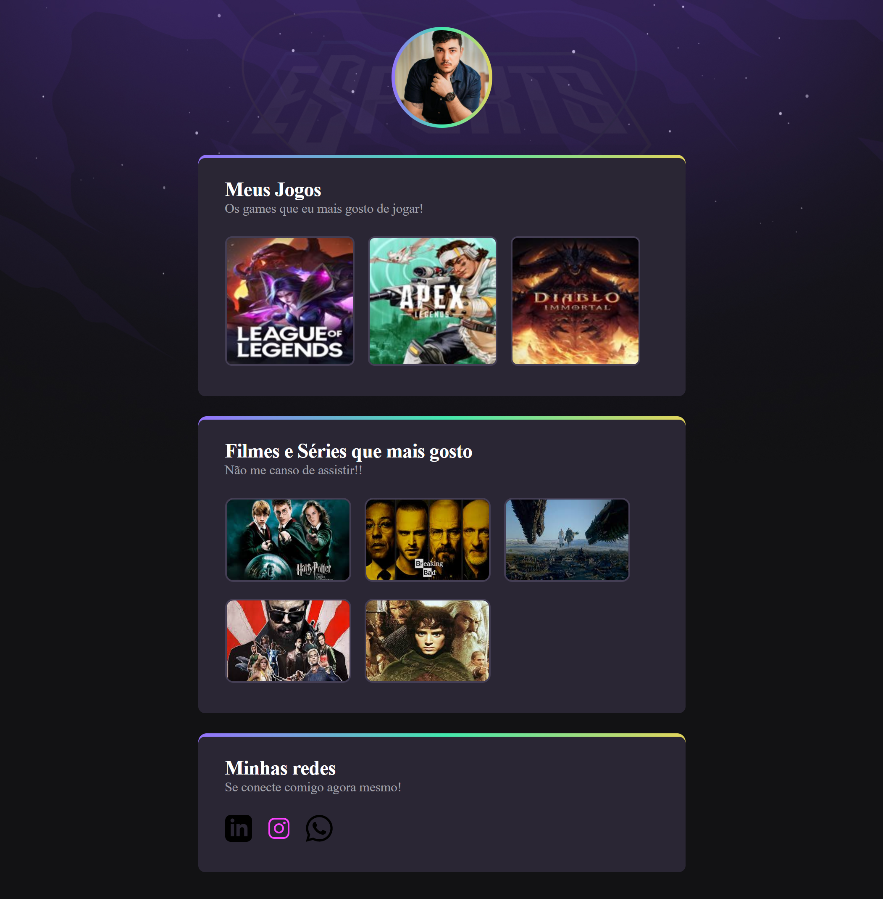

# Projeto Rean Soster

> Como desenvolvi

Projeto desenvolvido durante o evento Next Level Week da Rockeatseat, onde busco aperfeiçoamento na área de Desenvolvedor.

## Métodos aplicados

- HTML
- CSS
- Git e Github

## Clique aqui para acessar o projeto
[Clique aqui para acessar](https://reansoster.github.io/Projeto/)

## Contato 

- (67)99934-8824
- rean.soster@gmail.com